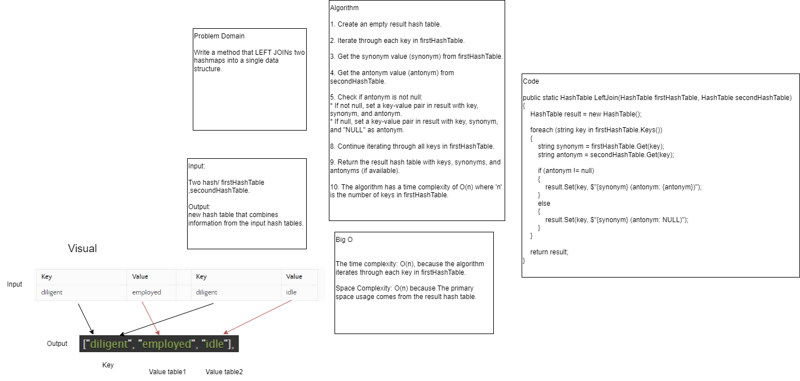

# Code Challenge Class 33: Hashmap LEFT JOIN

Write a method that LEFT JOINs two hashmaps into a single data structure.
This means that a left join returns all the values from the left table, plus matched values from the right table or NULL in case of no matching join predicate.

## Approach & Efficiency
The time complexity: O(n), because the algorithm iterates through each key in firstHashTable.

Space Complexity: O(n) because The primary space usage comes from the result hash table.

## Solution


## Code

```
public static HashTable LeftJoin(HashTable firstHashTable, HashTable secondHashTable)
{
    HashTable result = new HashTable();

    foreach (string key in firstHashTable.Keys())
    {
        string synonym = firstHashTable.Get(key);
        string antonym = secondHashTable.Get(key);

        if (antonym != null)
        {
            result.Set(key, $"{synonym} (antonym: {antonym})");
        }
        else
        {
            result.Set(key, $"{synonym} (antonym: NULL)");
        }
    }

    return result;
}
```
