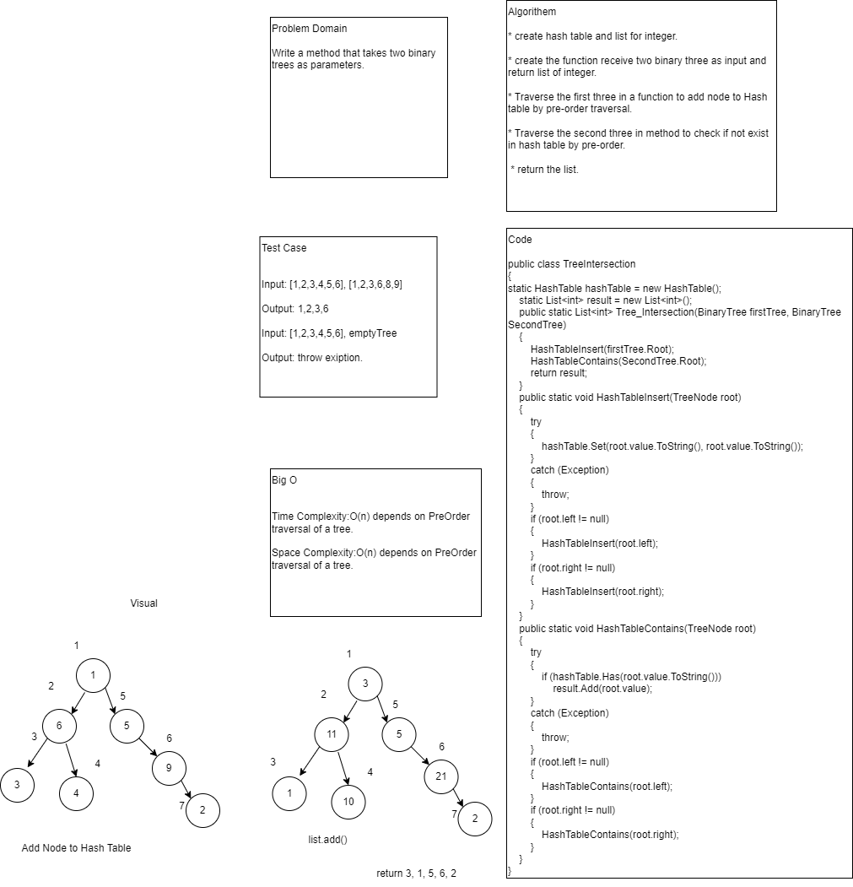

# Challenge Summary

Write a method that takes two binary trees as parameters.

## Whiteboard Process


## Approach & Efficiency
Time Complexity:O(n) depends on PreOrder traversal of a tree.

Space Complexity:O(n) depends on PreOrder traversal of a tree.

## Solution
To find common values in 2 binary trees you could write:

```
public class TreeIntersection
{
	static HashTable hashTable = new HashTable();
	static List<int> result = new List<int>();
	public static List<int> Tree_Intersection(BinaryTree firstTree, BinaryTree SecondTree)
	{
		HashTableInsert(firstTree.Root);
		HashTableContains(SecondTree.Root);
		return result;
	}
	public static void HashTableInsert(TreeNode root)
	{
		try
		{
			hashTable.Set(root.value.ToString(), root.value.ToString());
		}
		catch (Exception)
		{
			throw;
		}
		if (root.left != null)
		{
			HashTableInsert(root.left);
		}
		if (root.right != null)
		{
			HashTableInsert(root.right);
		}
	}
	public static void HashTableContains(TreeNode root)
	{
		try
		{
			if (hashTable.Has(root.value.ToString()))
				result.Add(root.value);
		}
		catch (Exception)
		{
			throw;
		}
		if (root.left != null)
		{
			HashTableContains(root.left);
		}
		if (root.right != null)
		{
			HashTableContains(root.right);
		}
	}
}
```
