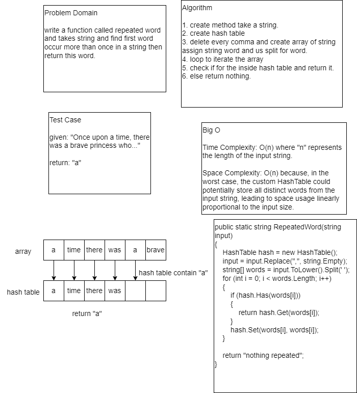

# Hashmap Repeated Word
write a function called repeated word and takes string and find first word occur more than once in a string then return this word.


## Whiteboard Process



## Approach & Efficiency
Time Complexity: O(n) where "n" represents the length of the input string.

Space Complexity: O(n) because, in the worst case, the custom HashTable could potentially store all distinct words from the input string, 
leading to space usage linearly proportional to the input size.

## Solution
```
 public static string RepeatedWord(string input)
 {
     HashTable hash = new HashTable();
     input = input.Replace(",", string.Empty);
     string[] words = input.ToLower().Split(' ');
     for (int i = 0; i < words.Length; i++)
     {
         if (hash.Has(words[i]))
         {
             return hash.Get(words[i]);
         }
         hash.Set(words[i], words[i]);
     }

     return "nothing repeated";
 }
```

