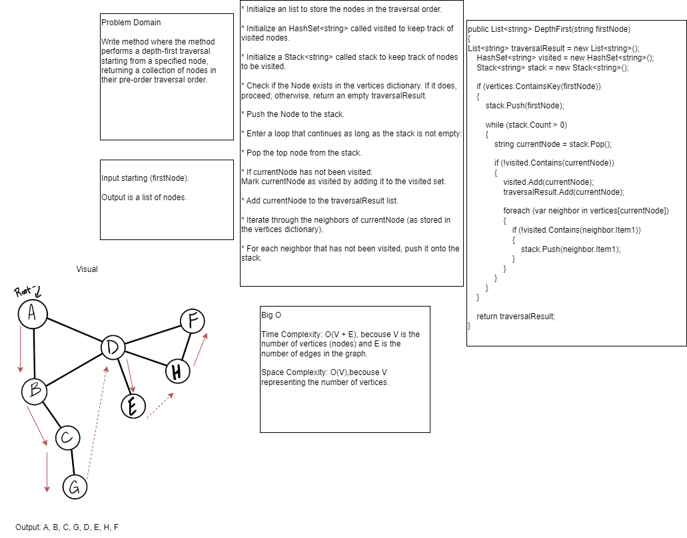

# Depth First of a Graph
Write method where the method performs a depth-first traversal starting from a specified node, returning a collection of nodes in their pre-order traversal order.

## Whiteboard


## Approach & Efficiency

Time Complexity: O(V + E), becouse V is the number of vertices (nodes) and E is the number of edges in the graph. 

Space Complexity: O(V),becouse V representing the number of vertices.  

## Code

```
public List<string> DepthFirst(string firstNode)
{
List<string> traversalResult = new List<string>();
    HashSet<string> visited = new HashSet<string>();
    Stack<string> stack = new Stack<string>();

    if (vertices.ContainsKey(firstNode))
    {
        stack.Push(firstNode);

        while (stack.Count > 0)
        {
            string currentNode = stack.Pop();

            if (!visited.Contains(currentNode))
            {
                visited.Add(currentNode);
                traversalResult.Add(currentNode);

                foreach (var neighbor in vertices[currentNode])
                {
                    if (!visited.Contains(neighbor.Item1))
                    {
                        stack.Push(neighbor.Item1);
                    }
                }
            }
        }
    }

    return traversalResult;
}
```


## Link: [Test](../GraphTests/UnitTest1.cs)
