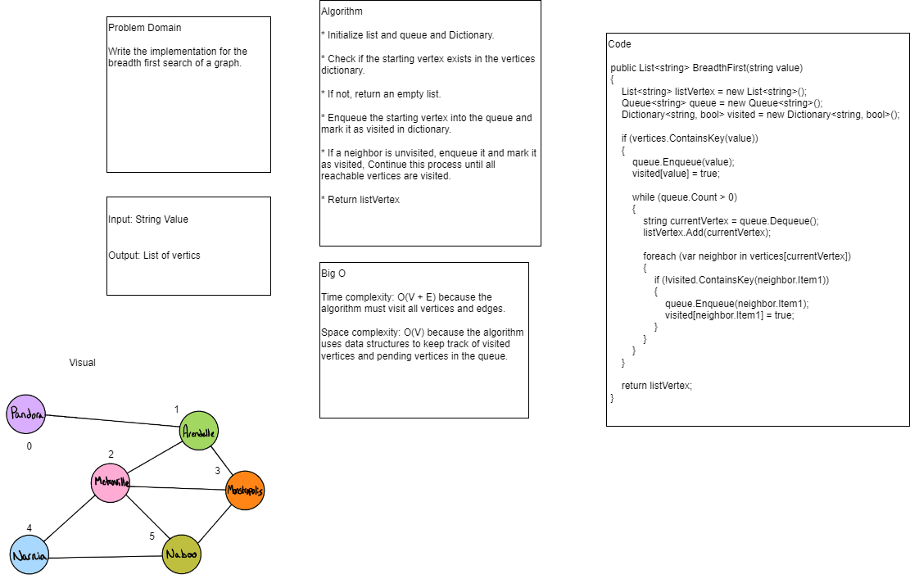

# Breadth-First Traversal of a Graph
Write the implementation for the breadth first search of a graph.

## Whiteboard


## Approach & Efficiency
Time complexity: O(V + E) because the algorithm must visit all vertices and edges.

Space complexity: O(V) because the algorithm uses data structures to keep track of visited vertices and pending vertices in the queue.

## Code

```
public List<string> BreadthFirst(string value)
{
    List<string> listVertex = new List<string>();
    Queue<string> queue = new Queue<string>();
    Dictionary<string, bool> visited = new Dictionary<string, bool>();

    if (vertices.ContainsKey(value))
    {
        queue.Enqueue(value);
        visited[value] = true;

        while (queue.Count > 0)
        {
            string currentVertex = queue.Dequeue();
            listVertex.Add(currentVertex);

            foreach (var neighbor in vertices[currentVertex])
            {
                if (!visited.ContainsKey(neighbor.Item1))
                {
                    queue.Enqueue(neighbor.Item1);
                    visited[neighbor.Item1] = true;
                }
            }
        }
    }

    return listVertex;
}
```


## Link: [Test](../GraphTests/UnitTest1.cs)
