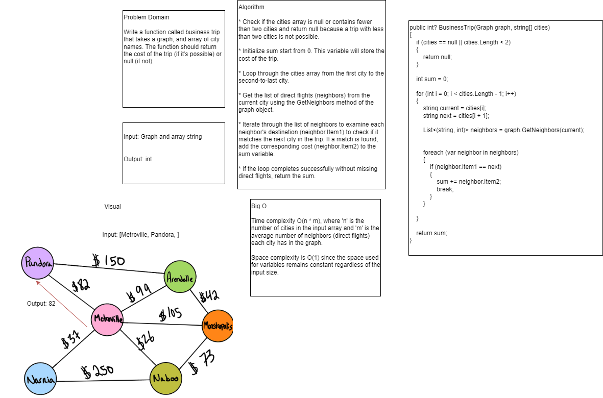

# Challenge Summary
Write a function called business trip that takes a  graph, and array of city names. The function should return the cost of the trip (if it’s possible) or null (if not).

## Whiteboard Process


## Approach & Efficiency

* Time complexity O(n * m), where 'n' is the number of cities in the input array and 'm' is the average number of neighbors (direct flights) each city has in the graph.

* Space complexity is O(1) since the space used for variables remains constant regardless of the input size.


## Code

```
public int? BusinessTrip(Graph graph, string[] cities)
{
    if (cities == null || cities.Length < 2)
    {
        return null;
    }

    int sum = 0;

    for (int i = 0; i < cities.Length - 1; i++)
    {
        string current = cities[i];
        string next = cities[i + 1];

        List<(string, int)> neighbors = graph.GetNeighbors(current);
        

        foreach (var neighbor in neighbors)
        {
            if (neighbor.Item1 == next)
            {
                sum += neighbor.Item2;
                break;
            }
        }

    }

    return sum;
}
```

## Link [Test](GraphTests/UnitTest1.cs)
