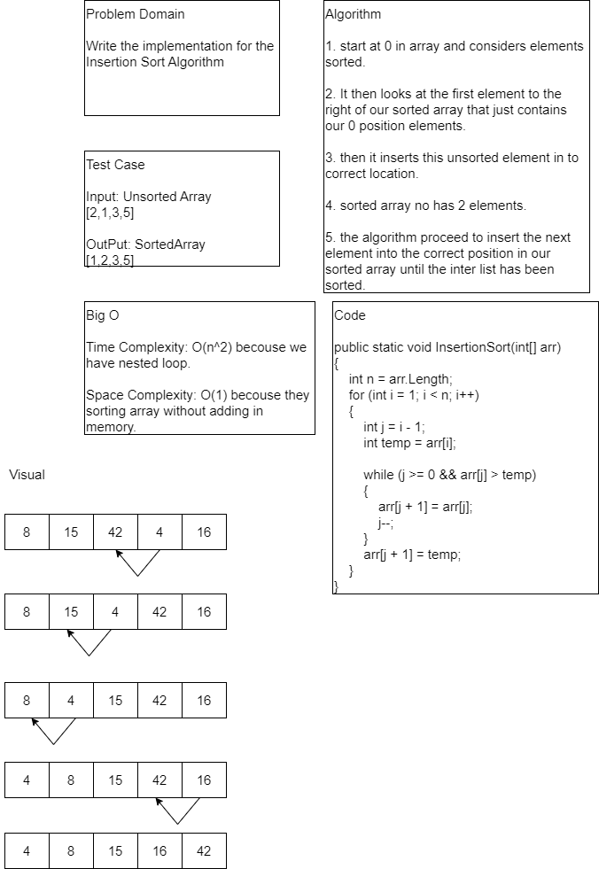

# Challenge 26

Write the implementation for the Insertion Sort Algorithm

## Whiteboard Process


## Approach & Efficiency

Time Complexity: O(n^2) becouse we have nested loop.

Space Complexity: O(1) becouse they sorting array without adding in memory.

## Solution

```
public static void InsertionSort(int[] arr)
        {
            int n = arr.Length;
            for (int i = 1; i < n; i++)
            {
                int j = i - 1;
                int temp = arr[i];

                while (j >= 0 && arr[j] > temp)
                {
                    arr[j + 1] = arr[j];
                    j--;
                }
                arr[j + 1] = temp;
            }
        }
```
