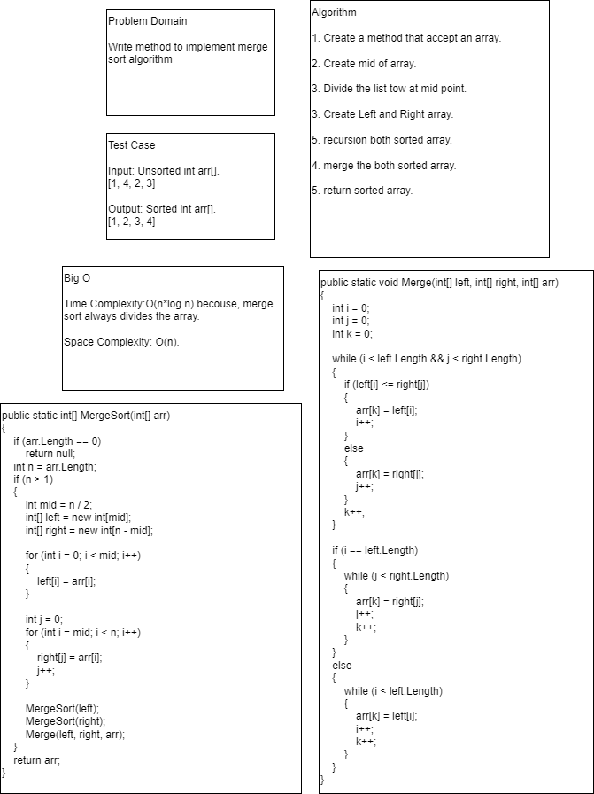

# Challenge 27

Write method to implement merge sort algorithm.

# Whiteboard Process



# Approach & Efficiency

Time Complexity:O(n*log n) becouse, merge sort always divides the array.

Space Complexity: O(n).


# Solution
```
public static int[] MergeSort(int[] arr)
{
    if (arr.Length == 0)
        return null;
    int n = arr.Length;
    if (n > 1)
    {
        int mid = n / 2;
        int[] left = new int[mid];
        int[] right = new int[n - mid];

        for (int i = 0; i < mid; i++)
        {
            left[i] = arr[i];
        }

        int j = 0;
        for (int i = mid; i < n; i++)
        {
            right[j] = arr[i];
            j++;
        }

        MergeSort(left);
        MergeSort(right);
        Merge(left, right, arr);
    }
    return arr;
}

public static void Merge(int[] left, int[] right, int[] arr)
{
    int i = 0;
    int j = 0;
    int k = 0;

    while (i < left.Length && j < right.Length)
    {
        if (left[i] <= right[j])
        {
            arr[k] = left[i];
            i++;
        }
        else
        {
            arr[k] = right[j];
            j++;
        }
        k++;
    }

    if (i == left.Length)
    {
        while (j < right.Length)
        {
            arr[k] = right[j];
            j++;
            k++;
        }
    }
    else
    {
        while (i < left.Length)
        {
            arr[k] = left[i];
            i++;
            k++;
        }
    }
}

# Challenge 26

Write the implementation for the Insertion Sort Algorithm

## Whiteboard Process


## Approach & Efficiency

Time Complexity: O(n^2) becouse we have nested loop.

Space Complexity: O(1) becouse they sorting array without adding in memory.

## Solution

```
public static void InsertionSort(int[] arr)
        {
            int n = arr.Length;
            for (int i = 1; i < n; i++)
            {
                int j = i - 1;
                int temp = arr[i];

                while (j >= 0 && arr[j] > temp)
                {
                    arr[j + 1] = arr[j];
                    j--;
                }
                arr[j + 1] = temp;
            }
        }

```
