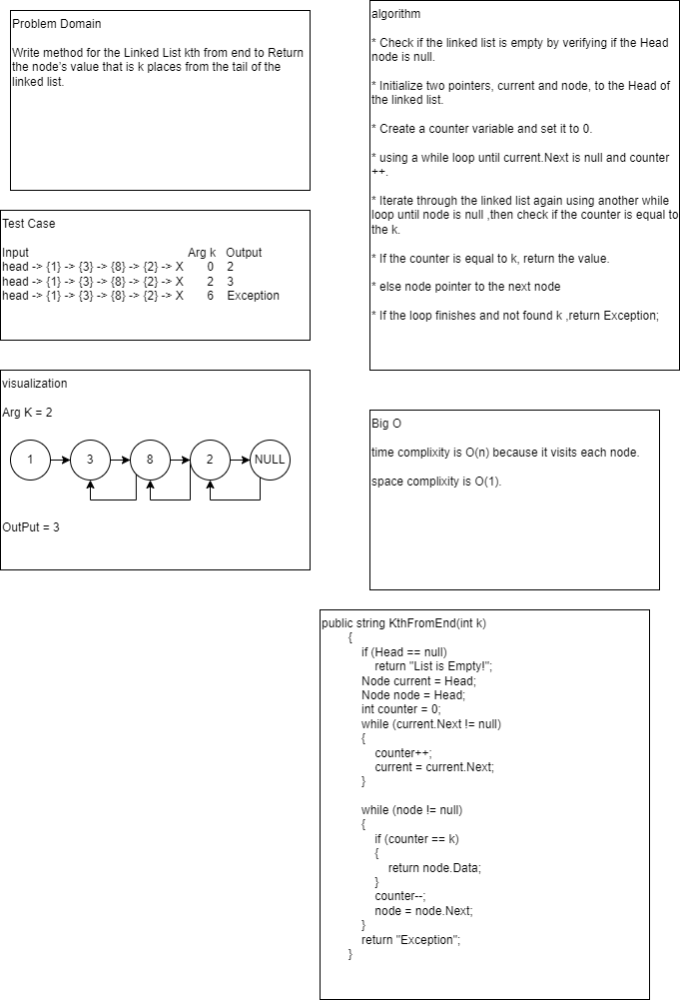

# Code Challenge 07: linked-list-kth
Write method for the Linked List kth from end to Return the node’s value that is k places from the tail of the linked list.

## Whiteboard Process

## Approach & Efficiency
time complixity is O(n) because it visits each node.

space complixity is O(1).

## Solution
unity test

