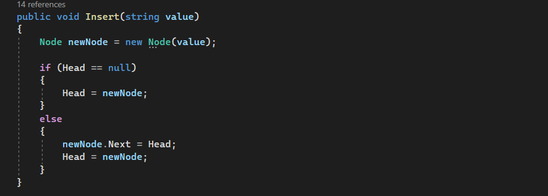
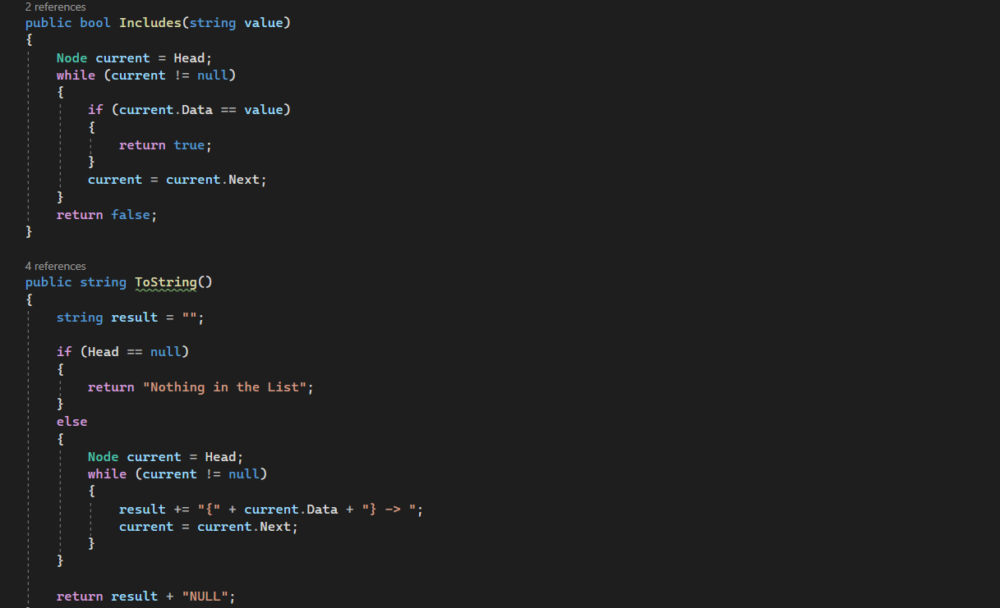
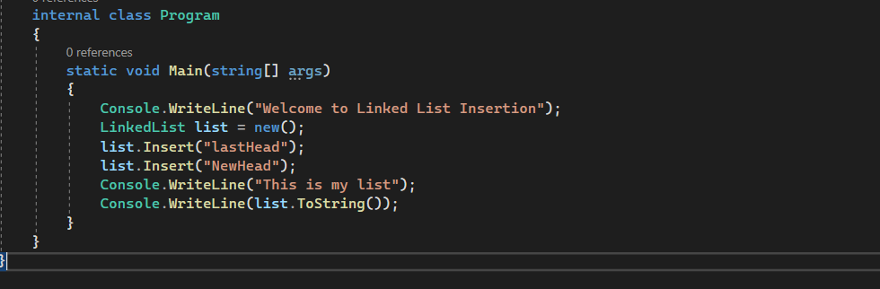
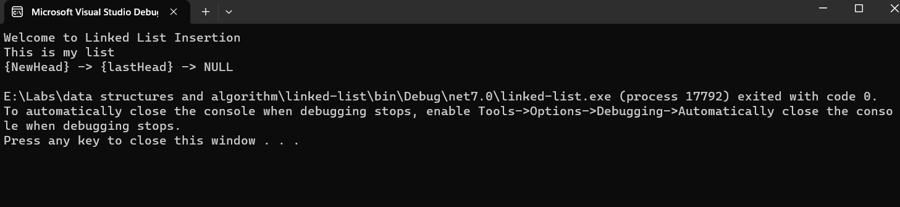

# Code Challenge 05: linked-list
A Linked List is a sequence of Nodes that are connected/linked to each other. The most defining feature of a Linked List is that each Node references the next Node in the link.

## Approach & Efficiency
Insert method time complixity is O(1) 
Includes method time complixity is O(n) 
ToString method time complixity is O(n) 

## Solution
Create a Linked List class that contain three methods: 

Insert : to Insert a new Node. 

Includes : to see if the List include a Node with a specific value. 
ToString : to Output the LinkedList. 

