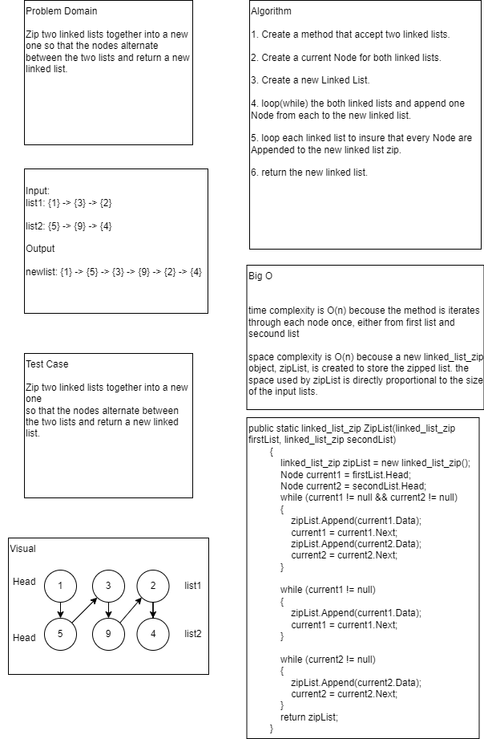
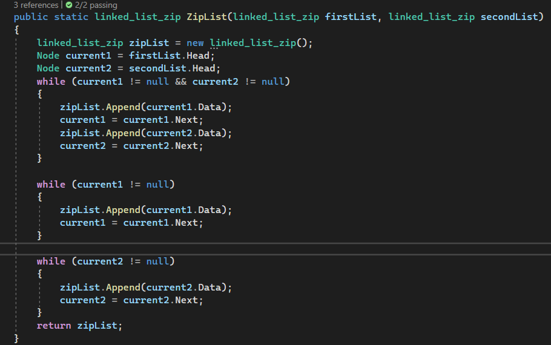
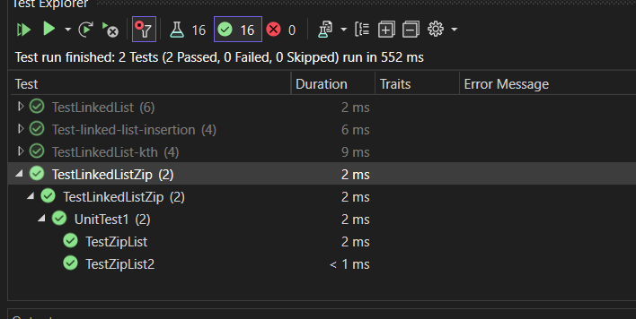

# Code Challenge 08: linked-list-zip
Write the following method for the Linked List class:

ZipList: Zip two linked lists together into a new one 
so that the nodes alternate between the two lists and return a new linked list.

## Whiteboard Process

## Approach & Efficiency

time complexity is O(n) becouse the method is iterates through each node once, either from first list and secound list

space complexity is O(n) becouse a new linked_list_zip object, zipList, is created to store the zipped list. the space used by zipList is directly proportional to the size of the input lists.
 

## Solution

unity test 

