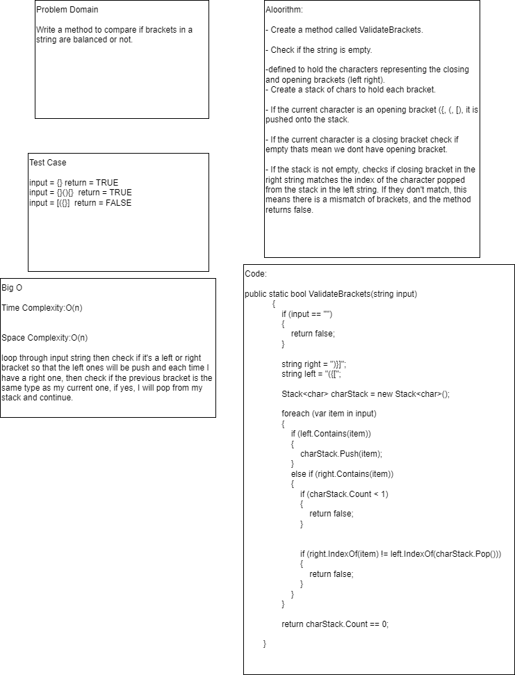
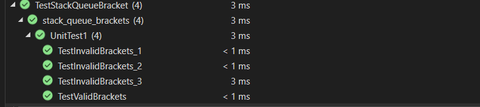

# Code Challenge: Class 13
# Stack Queue Brackets

## Problem Domain

Write a method to compare if brackets in a string are balanced or not.

## Whiteboard Process

## Approach & Efficiency

Time Complexity:O(n)

Space Complexity:O(n)

loop through input string then check if it's a left or right bracket so that the left ones will be push and each time I have a right one, then check if the previous bracket is the same type as my current one, if yes, I will pop from my stack and continue.

## Unity test

