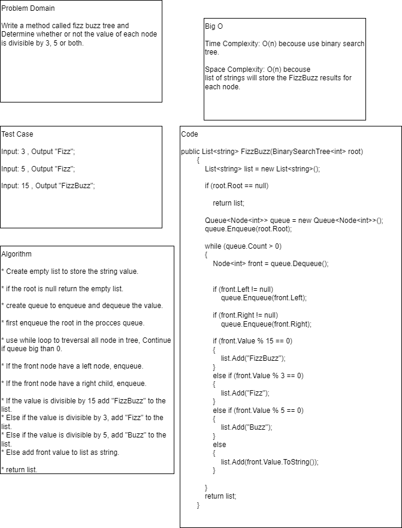
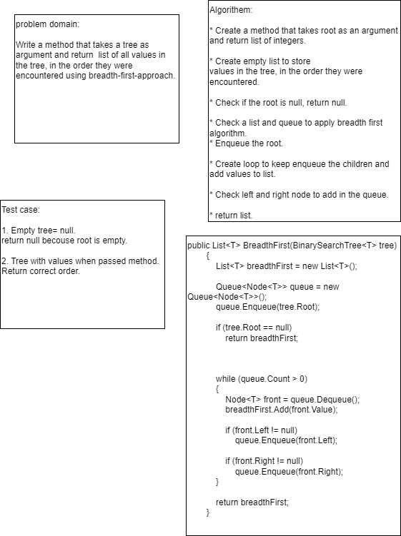
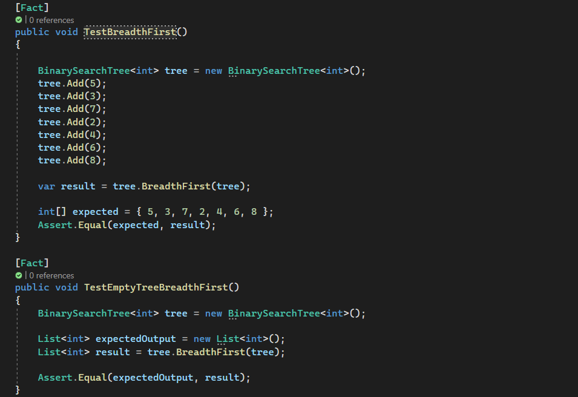
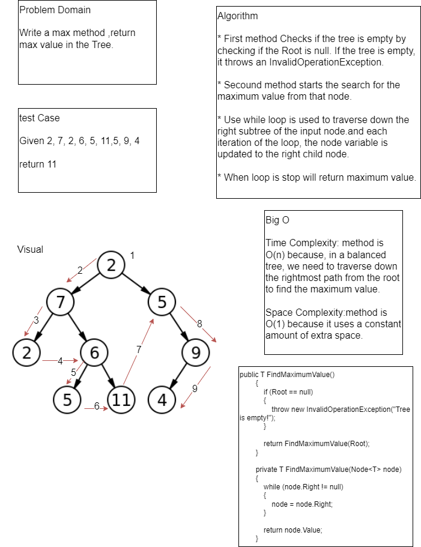
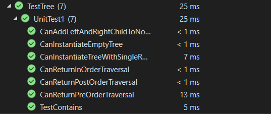

# Code Challenge: Class 18
# tree-fizz-buzz

## Write a method called fizz buzz tree and Determine whether or not the value of each node is divisible by 3, 5 or both. 

## Whiteboard

## Approach

Big O

Time Complexity: O(n) becouse use binary search tree.

Space Complexity: O(n) becouse 
list of strings will store the FizzBuzz results for each node.

# Code Challenge: Class 17
Write a method that takes a tree as argument and return list of all values in the tree, in the order they were encountered using breadth-first-approach.

## Whiteboard Process

## Unit Testing

# Tree Max
## Code Challenge: Class 16

Write a max method ,return max value in the Tree.

## Whiteboard Process

## Approach & Efficiency

Time Complexity: method is O(n) because, in a balanced tree, we need to traverse down the rightmost path from the root to find the maximum value.

Space Complexity:method is O(1) because it uses a constant amount of extra space. 

## Solution

# Class 15: Binary Tree and BST Implementation

## Approach & Efficiency
``PreOrder``, ``InOrder`` and ``PostOrder`` methods time complexity is O(n). 

``Add`` and ``Contains`` time complexity is also O(n).

1. ``PreOrder`` take a Tree and return a List ordered as Pre Order (Root Left Right).
2. ``InOrder`` take a Tree and return a List ordered as In Order (Left Root Right).
3. ``PostOrder`` take a Tree and return a List ordered as Post Order (Left Right Root).
4. ``Add`` take a Node and add it to a Binary Search Tree in the correct location.
5. ``Contains`` take a value and check if this value exist in the tree at least once or not.

## Unit Test

