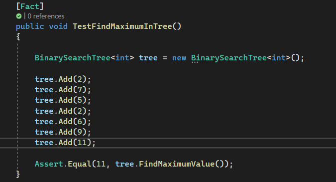

# Tree Max
## Code Challenge: Class 16

Write a max method ,return max value in the Tree.

## Whiteboard Process

## Approach & Efficiency

Time Complexity: method is O(n) because, in a balanced tree, we need to traverse down the rightmost path from the root to find the maximum value.

Space Complexity:method is O(1) because it uses a constant amount of extra space. 

## Solution

# Class 15: Binary Tree and BST Implementation

## Approach & Efficiency
``PreOrder``, ``InOrder`` and ``PostOrder`` methods time complexity is O(n). 

``Add`` and ``Contains`` time complexity is also O(n).

1. ``PreOrder`` take a Tree and return a List ordered as Pre Order (Root Left Right).
2. ``InOrder`` take a Tree and return a List ordered as In Order (Left Root Right).
3. ``PostOrder`` take a Tree and return a List ordered as Post Order (Left Right Root).
4. ``Add`` take a Node and add it to a Binary Search Tree in the correct location.
5. ``Contains`` take a value and check if this value exist in the tree at least once or not.

## Unit Test

